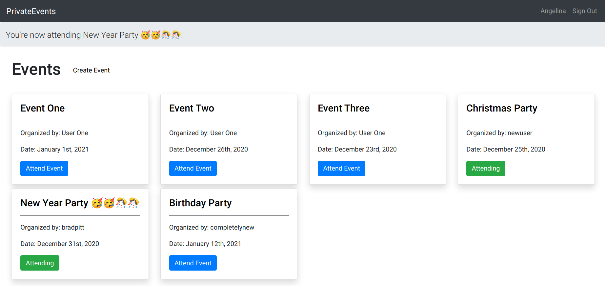

# PrivateEvents (Associations project)

This is a mini-project that allows you to

- Organize events
- Attend events
- See the list of atteendees for an event
- See the events organized by the user
- See the events, a user is attending



## Built With

- Ruby
- Ruby on Rails
- SQLite
- Atom
- VS Code

### Getting Started

### Prerequisites

To get this project up and running locally, you must have installed, ruby, rails and the necessary gems.

**To get this project set up on your local machine, follow these simple steps:**

1. Open Terminal.
2. Navigate to your desired location to download the contents of this repository.
3. Clone this repository: git clone https://github.com/tnyandoro/private-events
4. Run ```cd private-events```.
5. Run ```bundle install``` to get the necesary gems.
6. Run `rails db:migrate`.

## Use

- Navigate to the root directory of the project
- Run `rails server`
- Open a browser and visit `127.0.0.1:3000`
- Sign in and create events!


## Authors

👤 **Alaukik**

- Github: [@newhorizon-tech](https://github.com/newhorizon-tech)
- Twitter: [@techintosh3](https://twitter.com/techintosh3)

👤 **Tendai Nyandoro**

- GitHub: [@Tendai Nyandoro](https://github.com/tnyandoro)
- Twitter: [@tendai28](https://twitter.com/tendai28)
- LinkedIn: [Tendai Nyandoro](https://www.linkedin.com/in/tendai-nyandoro/)

## Acknowledgements

- Odin Projects
- Official Rails Guide https://guides.rubyonrails.org/

## 🤝 Contributing

Contributions, issues, and feature requests are welcome!

Feel free to check the [issues page](https://github.com/tnyandoro/private-events/issues).

## Show your support

Give a ⭐️ if you like this project!
